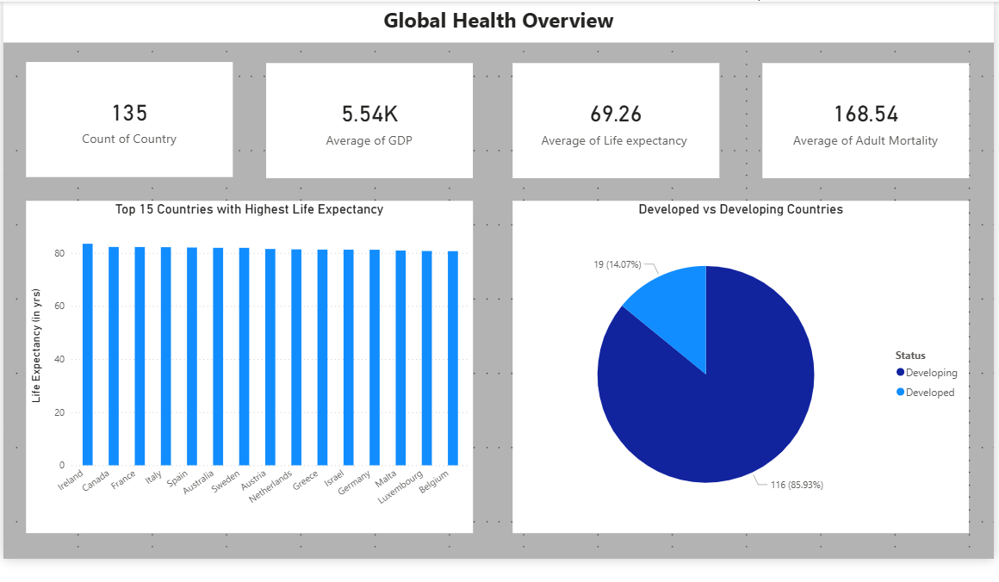
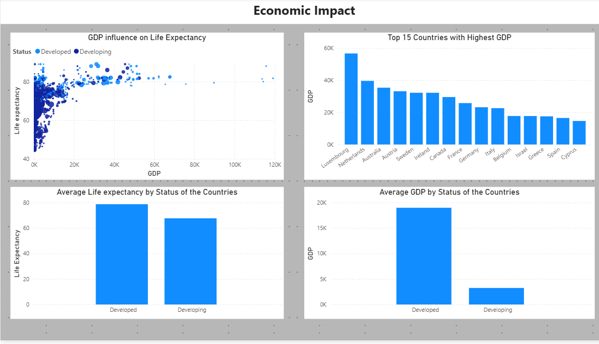
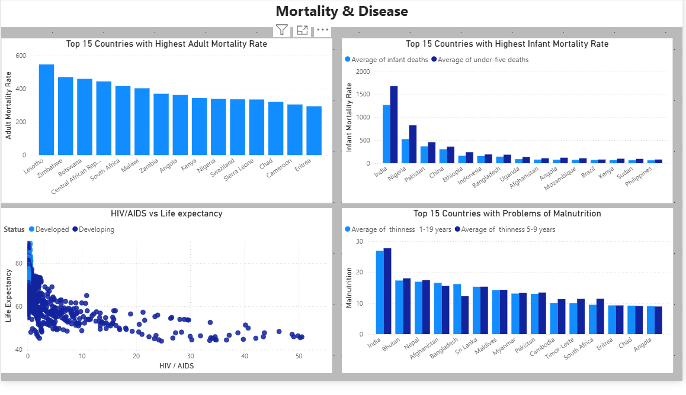
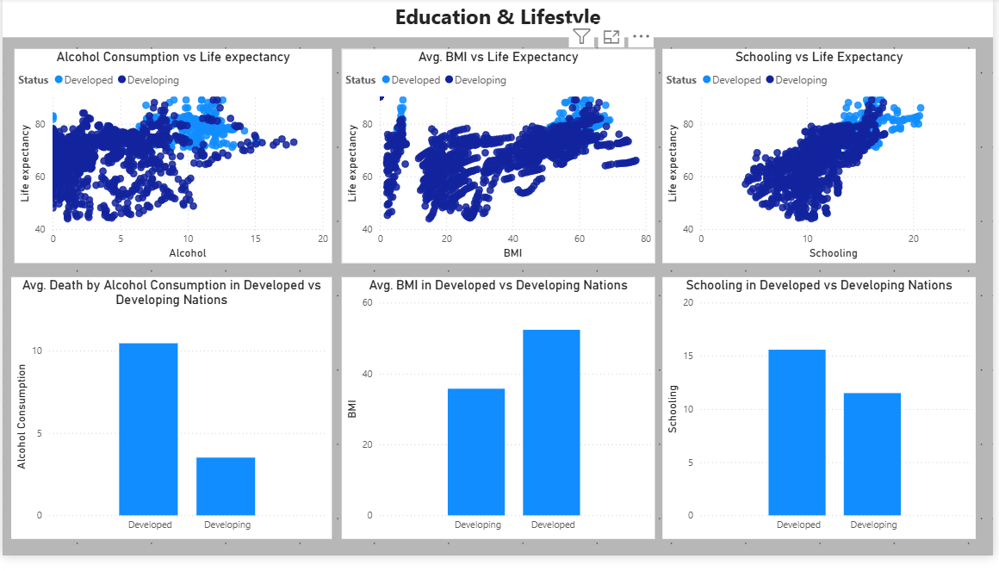

# 🌍 Global Life Expectancy Analysis
### Data Visualization & Insights using Microsoft Power BI

---

# 📖 The Story Behind the Project

Across the world, people live vastly different lives — not just culturally or economically, but also in **how long they live**.

Some countries enjoy life expectancies above **80 years**, while others struggle with significantly lower averages. This difference raises an important question:

> **What factors truly influence how long people live?**

Is it **economic development**, **healthcare access**, **education**, or **disease prevalence**?

This project was created to explore these questions using **data analytics and visualization**. By analyzing global health data, the goal was to uncover patterns and relationships that affect life expectancy across countries.

Using **interactive dashboards**, the project transforms raw data into meaningful insights that help us better understand **global health disparities**.

---

# 🎯 Project Objective

The main objectives of this project are:

- Analyze global life expectancy data
- Identify factors influencing life expectancy
- Compare developed and developing countries
- Visualize global health trends through interactive dashboards
- Generate meaningful insights using data analytics

---

# 📊 Dataset Overview

The dataset used in this project contains **global health indicators collected across multiple countries and years**.

## Key Attributes

| Feature | Description |
|-------|-------------|
| Country | Name of the country |
| Year | Year of data collection |
| Status | Developed or Developing country |
| Life Expectancy | Average lifespan |
| Adult Mortality | Adult death rate |
| Infant Deaths | Infant mortality count |
| GDP | Economic performance indicator |
| Population | Country population |
| Schooling | Average years of education |
| Alcohol | Alcohol consumption rate |
| BMI | Body Mass Index |
| HIV/AIDS | Disease prevalence indicator |

The dataset provides a **multi-dimensional view of global health conditions**.

---

# 🛠 Tools Used

This project was developed using:

- **Microsoft Power BI** – Data visualization and dashboard creation  
- **Microsoft Excel** – Initial data preparation and cleaning  

Power BI was used to build **interactive dashboards** that allow exploration of relationships between different health and economic indicators.

---

# 🔎 Data Cleaning & Preparation

Before analysis, the dataset was cleaned to ensure accuracy and usability.

### Steps Performed

- Removed unnecessary columns
- Fixed inconsistent column names
- Handled missing values
- Verified correct data types
- Filtered relevant health indicators

This preprocessing ensured **reliable analysis and meaningful visualizations**.

---

# 📈 Dashboard Overview

The project consists of **multiple dashboard pages**, each focusing on different aspects of life expectancy.

---

# 🌎 Page 1 — Global Overview

Provides a **high-level summary of global health indicators**.

### Visualizations Include

- Average Life Expectancy
- GDP and Schooling indicators
- Global Life Expectancy Trend
- Country Status Distribution
- World Map showing Life Expectancy

### Insight

Life expectancy has **generally increased over time**, but noticeable differences remain between **developed and developing countries**.

### Dashboard Preview

---

# 💰 Page 2 — Economic Impact

Analyzes how **economic development affects life expectancy**.

### Visualizations

- GDP vs Life Expectancy scatter plot
- Top countries with highest life expectancy
- Economic comparison between developed and developing countries

### Insight

Countries with **stronger economies** tend to have **higher life expectancy** due to improved healthcare infrastructure and living standards.

### Dashboard Preview

---

# 🏥 Page 3 — Mortality & Disease Analysis

Explores how **health risks influence life expectancy**.

### Visualizations

- Adult mortality distribution
- HIV/AIDS impact on life expectancy
- Infant death statistics

### Insight

Higher mortality rates and disease prevalence significantly reduce life expectancy in many regions.

### Dashboard Preview

---

# 🎓 Page 4 — Education & Lifestyle

Analyzes the influence of **education and lifestyle factors**.

### Visualizations

- Schooling vs Life Expectancy
- Alcohol Consumption vs Life Expectancy
- BMI distribution across countries

### Insight

Education plays a crucial role in improving health outcomes and increasing life expectancy.

### Dashboard Preview

---

# 🔍 Key Insights

From the analysis, several important observations were identified:

📌 Economic development strongly influences life expectancy  
📌 Education levels positively correlate with health outcomes  
📌 Higher mortality rates reduce life expectancy significantly  
📌 Disease prevalence such as **HIV/AIDS** impacts lifespan in certain regions  

These insights highlight the **complex relationship between economic, social, and health factors**.

---

# 🚀 Future Scope

The project can be expanded further in several ways:

- Integrating real-time global health datasets
- Applying machine learning models to predict life expectancy
- Adding additional health indicators such as healthcare expenditure
- Developing predictive dashboards for policymakers

Such enhancements could provide **deeper insights into global health challenges**.

---

# 📚 References

### Data Source

World Health Organization (WHO) Global Health Dataset

### Tools

- Microsoft Power BI
- Microsoft Excel

---

# ✨ Final Thoughts

Data tells stories — stories about **societies, health, and human progress**.

This project demonstrates how **data analytics and visualization** can transform complex datasets into meaningful insights that help us better understand the world we live in.

---
## 👤 Author

**Vidhi Pateliya**

Project completed as part of the  
**Microsoft Elevate – Power BI Data Analyst Internship**

---
